# sensor-isu

ISU (Integrated Sensor Unit) da TRONIK: hardware que fica no coletor, estima enchimento com sensores ToF, usa o acelerômetro para acordar em impacto e envia dados via Wi-Fi.

O código da **dashboard** não mora aqui — está em [github.com/natanheringer/dashboard-tronik](https://github.com/natanheringer/dashboard-tronik). Este repo é só dispositivo + documentação de montagem.

**`isu_tronik_v2.ino`** — firmware para ESP32 DOIT DevKit V1, três VL53L0X, MPU6050, deep sleep entre leituras e POST HTTP via Wi-Fi. Bibliotecas e pinos estão comentados no próprio arquivo; rede Wi-Fi, servidor e IDs ficam no bloco de configuração no topo.

**`02_MVP.md`** — o que entra no MVP, máquina de estados, formato do JSON que o backend espera, plano de teste em bancada/campo. Se mudar o payload, alinhar com o repo da dashboard.

**`01_COMPRAS_E_MONTAGEM_v3.md`** — lista de materiais e passo a passo de montagem. O PDF espelha o markdown.

**`sensor-isu.blend`** — modelo 3D no Blender.

## Firmware no Arduino IDE

1. Baixe o projeto: `git clone https://github.com/natanheringer/sensor-isu.git` ou pelo site do GitHub em **Code → Download ZIP** (depois descompacte).
2. Instale o [Arduino IDE](https://www.arduino.cc/en/software) (2.x ou 1.8+).
3. Adicione suporte à ESP32: em *File → Preferences*, em *Additional boards manager URLs*, cole `https://espressif.github.io/arduino-esp32/package_esp32_index.json`; depois *Tools → Board → Boards Manager*, busque **esp32** e instale o pacote da Espressif.
4. Abra `isu_tronik_v2.ino` (*File → Open*). Se o IDE pedir pasta para o sketch, aceite — o `.ino` precisa ficar numa pasta com o mesmo nome do arquivo.
5. *Tools → Board* → **DOIT ESP32 DEVKIT V1** ou **ESP32 Dev Module**. *Tools → Port* → a COM que aparece com a placa no USB.
6. Em *Sketch → Include Library → Manage Libraries*, instale as dependências citadas no cabeçalho do `.ino` (WiFi, HTTPClient, ArduinoJson, Adafruit VL53L0X, Adafruit MPU6050, Adafruit Unified Sensor).
7. Ajuste SSID/senha do Wi-Fi, host e IDs no topo do código, depois *Sketch → Upload*.

Sem a placa na mão, dá para só compilar (*Sketch → Verify*) para checar se as bibliotecas estão ok.

## Layout interno (SVG)

Vista de cima com a tampa fora — posição aproximada da PCB, bateria, MPU e ToF:

## Licença

Código e documentação aqui: **GNU GPLv3** — ver [LICENSE](LICENSE).
